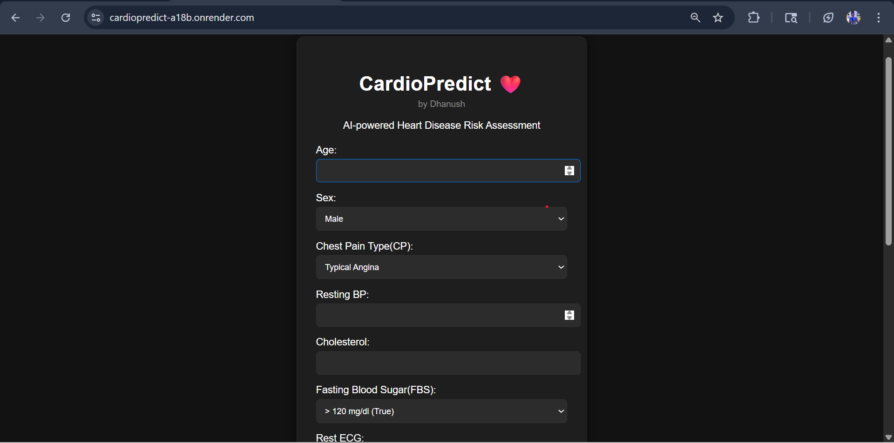
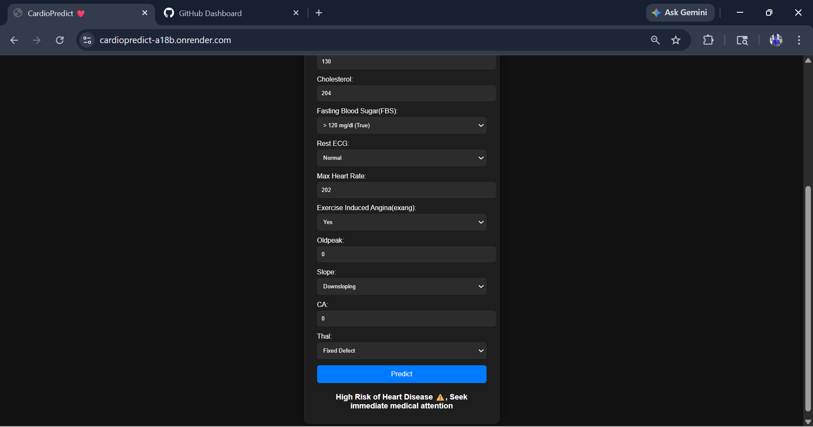
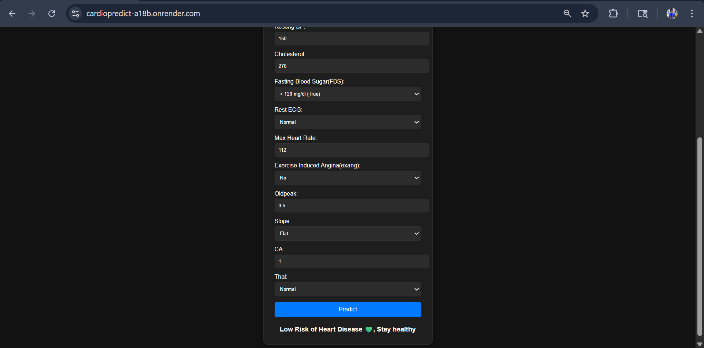

# ❤️ CardioPredict — Heart Disease Prediction App

An end-to-end Machine Learning web application that predicts the risk of heart disease based on patient health parameters.

---

##  Live Demo
🔗 https://cardiopredict-a18b.onrender.com

---

##  Project Overview

CardioPredict is an ML-powered web application that:

- Takes medical inputs (age, cholesterol, blood pressure, etc.)
- Predicts heart disease risk using trained ML models
- Provides real-time results via a FastAPI backend
- Deployed on Render for public access

---

## 📸 Screenshots

<p align="center">
  
  <br><br>
  
  <br><br>
  
</p>

##  Machine Learning Approach

### Models Used:
- Logistic Regression ✅ (Final Model)
- Random Forest (Baseline)

###  Model Comparison:

| Model                | Accuracy |
|---------------------|---------|
| Logistic Regression | **88.5%**  |
| Random Forest       | 83.6% |

✔ Logistic Regression was selected as the final model due to better performance.

---

##  Model Evaluation

- Accuracy: ~88%
- Balanced Precision & Recall
- Confusion Matrix analyzed
- Classification Report evaluated

---

##  Feature Importance (Random Forest)

Feature importance analysis was performed to understand key factors influencing predictions.

Top contributing features include:
- Age
- Cholesterol
- Max Heart Rate
- Chest Pain Type

---

## 🛠️ Tech Stack

###  Backend:
- FastAPI
- Uvicorn

###  Machine Learning:
- Scikit-learn
- Pandas
- NumPy

###  Visualization:
- Matplotlib

###  Frontend:
- HTML / CSS (Minimal UI)

###  Deployment:
- Render

---

## 📂 Project Structure

```
CardioPredict/
│
├── app/
│   ├── main.py
│   ├── templates/
│   │   └── index.html
│   └── model/
│       ├── model.pkl
│       └── scaler.pkl
│
├── data/
│   └── heart.csv
│
├── notebook/
│   └── heart_disease_analysis.ipynb
│
├── requirements.txt
├── render.yaml
├── README.md
└── .gitignore
```

---

##  How It Works

1. User inputs health data via UI  
2. Data sent to FastAPI backend  
3. Model processes input  
4. Prediction returned (0 = No Disease, 1 = Risk)  
5. Result displayed instantly  

---

##  Key Highlights

*  End-to-end ML pipeline
*  Model comparison & selection
*  Real-world deployment
*  Clean UI with prediction output
*  Feature importance analysis

---

##  Future Improvements

* Add risk percentage score
* Explain predictions (model interpretability)
* Improve UI/UX
* Add more advanced models (XGBoost, etc.)

---
## 👨‍💻 Author

**Dhanush Gowda**

🔗 GitHub: https://github.com/DhanushGowda22

---

## ⭐ Support

If you like this project, consider giving it a ⭐ on GitHub!
